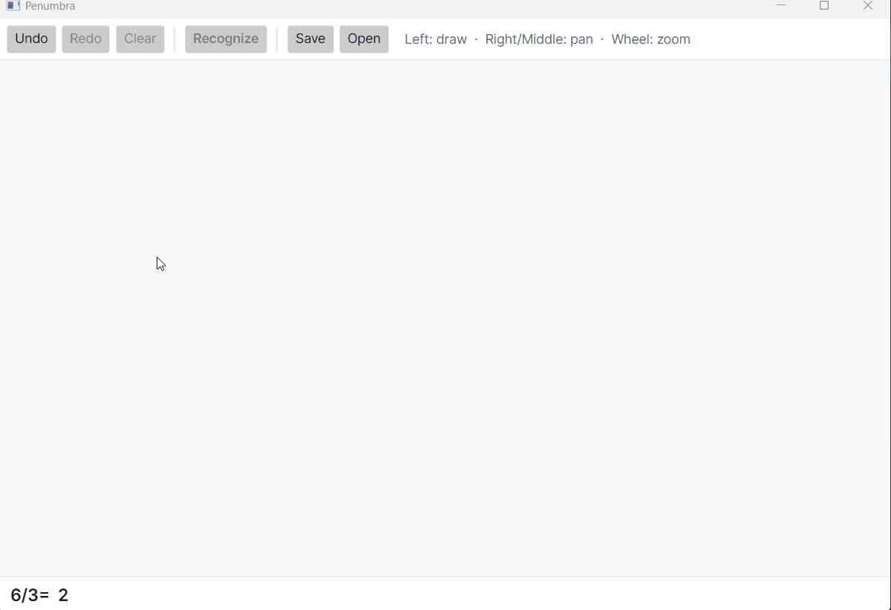

# Penumbra

**Write math by hand. Watch it answer in your own handwriting.**

Penumbra is a local, offline math notebook. Sketch an equation with your pen and it recognizes your
handwriting, solves it with a real computer-algebra system, and writes the answer back in *your* hand —
no cloud, no account, everything on your device.



## Download

**Latest release:** `v0.0.2` for Windows x64.

Download `Penumbra-v0.0.2-win-x64.zip` from
[Releases](https://github.com/aeyvmor/penumbra/releases/latest), unzip it, and run
`Penumbra.App.exe`.

Windows may warn because this early build is not signed yet.

## What Works Today

Penumbra is in active early development. Expect rough edges.

- Write a single-line expression ending in `=` (for example `2+2=`, `21+7=`, `4+1-9=`) — lift the
  pen, and a beat later the answer writes itself from the `=` in animated handwriting. No button.
- Symbols Penumbra isn't sure about desaturate and shiver; when it can't read a line at all, it
  says so instead of guessing (the recognizer is confidence-calibrated and refuses non-math ink).
- Tap an answer to highlight the exact strokes it came from.
- Penumbra passively learns your digits/operators as you use it; missing symbols fall back to the
  bundled Caveat handwriting font.
- Everything runs offline on your machine.

Recognition works best with clearly separated symbols. Fractions, radicals, superscripts, brackets,
graphing, the reactive sheet, and the tutor are future work.

## Building

Requires the **.NET SDK 8.0+** and **Git LFS**. The recognizer model ships via LFS.

```bash
git lfs install
git clone https://github.com/aeyvmor/penumbra.git
cd penumbra
dotnet test Penumbra.sln
dotnet run --project src/Penumbra.App
```

## License

[MIT](LICENSE).

The shipped recognizer weights have their own provenance note in
[`src/Penumbra.Recognition/Models/MODELCARD.md`](src/Penumbra.Recognition/Models/MODELCARD.md).

## Acknowledgements

Penumbra grew from an earlier C++ proof-of-concept. Inspired by Apple's Math Notes and by the original
Python concept from Ayush Pai. Handwriting font: *Caveat* (Google Fonts).
